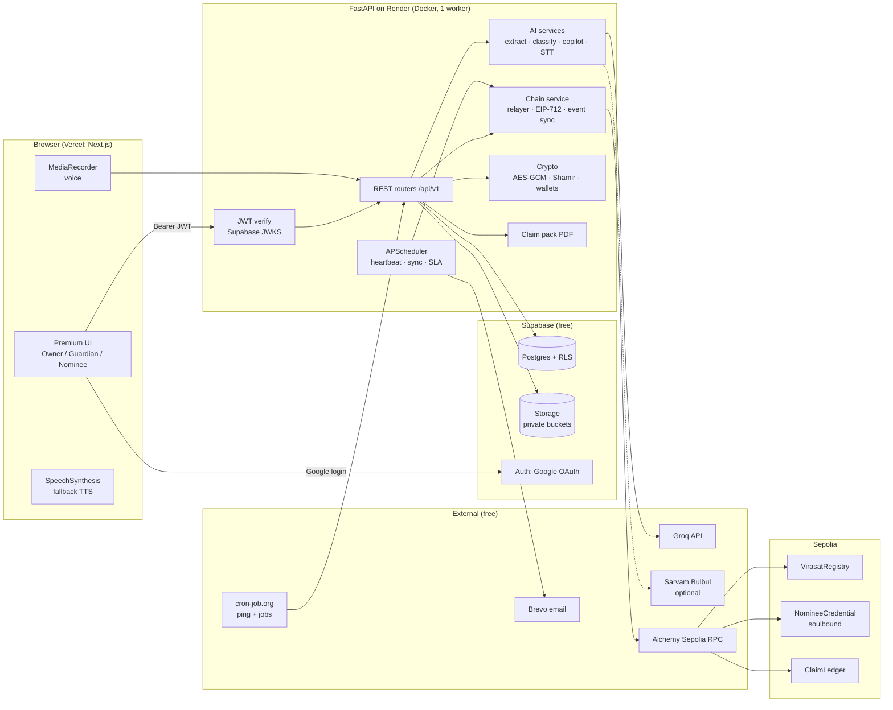
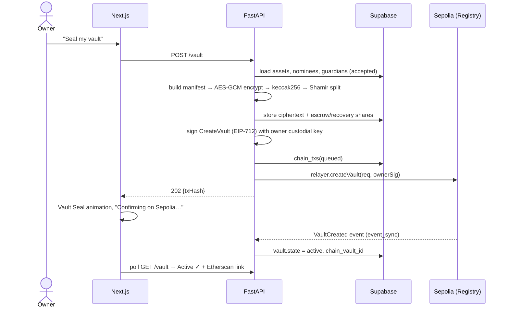
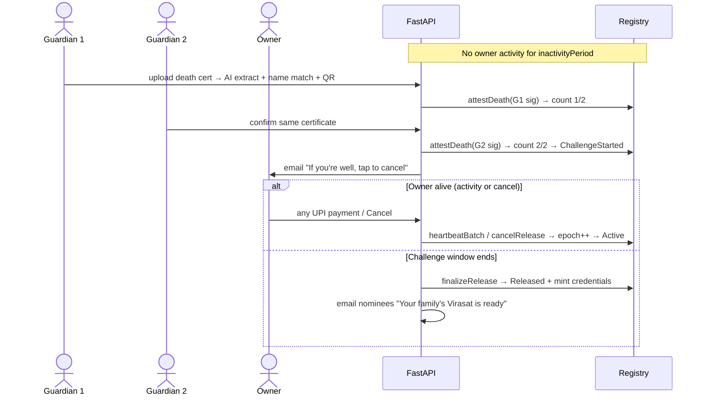
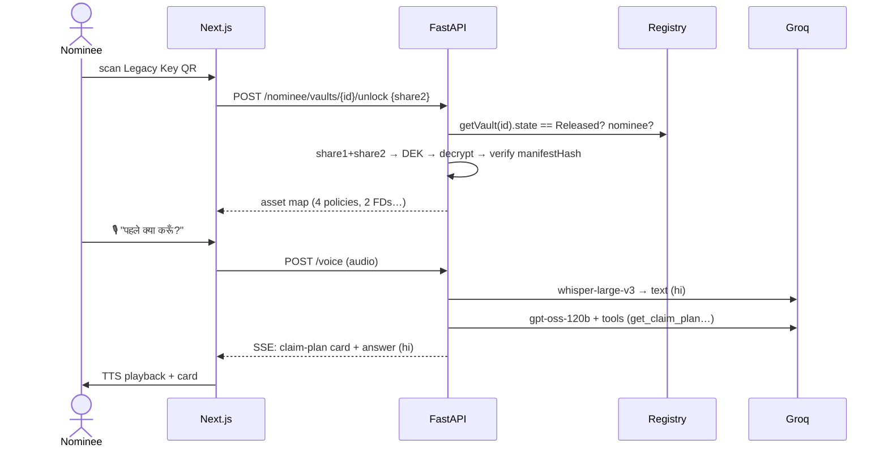

# Paytm Virasat: Implementation Plan

> **Jo aapka hai, woh aapke apno tak pahunche.** (What's yours should reach your family.)
>
> Track 2, AI-Powered Financial Journeys: Paytm Build for India AI Hackathon, Mumbai Edition (3 Oct 2026)

---

## Table of Contents

1. [Product Summary](#1-product-summary)
2. [Scope: Must-Have vs Stretch](#2-scope-must-have-vs-stretch)
3. [Tech Stack](#3-tech-stack)
4. [System Architecture](#4-system-architecture)
5. [Repository Layout](#5-repository-layout)
6. [Design System (Frontend Look & Feel)](#6-design-system-frontend-look--feel)
7. [Frontend: Routes & Screens](#7-frontend-routes--screens)
8. [Backend: FastAPI Services & API](#8-backend-fastapi-services--api)
9. [Database: Supabase Schema](#9-database-supabase-schema)
10. [Blockchain: Solidity Contracts on Sepolia](#10-blockchain-solidity-contracts-on-sepolia)
11. [Cryptography: Sealed Manifest & Legacy Key](#11-cryptography-sealed-manifest--legacy-key)
12. [AI Layer: Groq](#12-ai-layer-groq)
13. [End-to-End Flows (Sequence Diagrams)](#13-end-to-end-flows-sequence-diagrams)
14. [Security, Privacy & Compliance](#14-security-privacy--compliance)
15. [Free-Tier Deployment](#15-free-tier-deployment)
16. [Environment Variables](#16-environment-variables)
17. [Testing Strategy](#17-testing-strategy)
18. [Timeline & Team Split (26 Sep → 3 Oct)](#18-timeline--team-split-26-sep--3-oct)
19. [Demo Script & Seed Data](#19-demo-script--seed-data)
20. [Risks & Mitigations](#20-risks--mitigations)
21. [Post-Hackathon Roadmap](#21-post-hackathon-roadmap)

---

## 1. Product Summary

Paytm Virasat covers two stages of one financial journey:

| Phase | Who | What happens |
|---|---|---|
| **A. Legacy Vault** (while the user is alive) | Account owner | The AI finds the owner's policies, FDs, mutual funds and loans, reads their documents, and flags missing or outdated nominees. The owner picks nominees and guardians. Everything is sealed into an encrypted manifest. Its hash and release rules are stored on-chain. Normal Paytm activity counts as **automatic proof of life**. |
| **B. Claim Co-pilot** (after death) | Guardians, then nominees | Owner inactive, **plus** M-of-N guardian attestations with a death certificate, **plus** a challenge window the owner can cancel in, leads to an on-chain **release**. Nominees receive a soulbound credential. They unlock the manifest with their Legacy Key and talk to a **voice-first, multilingual AI co-pilot**. The co-pilot ranks claims, prepares claim packs, tracks SLAs (with every step timestamped on-chain), and drafts escalation letters. |

**Core principle:** the AI does the hard work, the smart contract enforces trust, and the family only sees plain, kind language in their own tongue.

---

## 2. Scope: Must-Have vs Stretch

Build the must-haves first. Every stretch item must be able to fail without breaking the demo.

### Must-have (the demo depends on these)
- [ ] Google sign-in (Supabase Auth). Roles are Owner, Nominee and Guardian (one user can hold several).
- [ ] Asset discovery from **(a)** an uploaded bank statement (PDF/CSV), **(b)** pasted SMS, and **(c)** a simulated "Paytm transaction feed" (seeded).
- [ ] Policy document upload with AI extraction of insurer, policy number, sum assured, nominee and claim documents.
- [ ] Legacy Score, plus nominee gap and coverage gap cards.
- [ ] Nominee and guardian invites by email, accepted with a Google login.
- [ ] Vault created on **Sepolia** through a gasless relayer. Users never touch crypto.
- [ ] Proof of life: activity events lead to batched on-chain heartbeats.
- [ ] A guardian uploads a death certificate. The AI extracts it, a name match runs, and an EIP-712 attestation is recorded on-chain.
- [ ] Challenge window, owner cancel, finalize release, and soulbound Nominee Credential mint.
- [ ] Nominee unlocks the manifest with the Legacy Key (QR).
- [ ] Claim Co-pilot chat in text **and** voice (Hindi, Marathi, English) using Groq Whisper and a Groq LLM.
- [ ] Ranked claim plan, per-institution checklist, and a generated **claim pack PDF**.
- [ ] Claim tracker with on-chain event log and Etherscan links.
- [ ] Public `/verify/[tokenId]` page for institutions.
- [ ] **Demo Mode**: time-warp controls that shrink periods to seconds or minutes.
- [ ] Deployed: Vercel (frontend), Render (backend), Supabase (database).

### Stretch (only if ahead of schedule)
- [ ] Sarvam Bulbul TTS for natural Indic voice (falls back to the browser Web Speech API).
- [ ] SLA breach, then an auto-drafted escalation (insurer GRO, then IRDAI Bima Bharosa, then Ombudsman).
- [ ] Etherscan contract source verification.
- [ ] Supabase Realtime push for vault status (polling is the default).
- [ ] Account Aggregator sandbox (Setu) for real statement fetch.
- [ ] PWA install and offline read of the claim checklist.
- [ ] Owner "letter to family" (encrypted voice or text note released with the vault).

---

## 3. Tech Stack

Everything below is free or open source and works within the free tiers of Vercel Hobby, Render Free and Supabase Free.

### Frontend: `frontend/`
| Concern | Choice | Why |
|---|---|---|
| Framework | **Next.js (latest stable, App Router, TypeScript, RSC)** | Required. Vercel-native. |
| Styling | **Tailwind CSS v4** | Design tokens via CSS variables. Fast. |
| Components | **shadcn/ui** (Radix primitives) | Accessible, owned source, easy to restyle premium. |
| Animation | **Motion** (`motion`, formerly Framer Motion) | Springs, layout and shared-element transitions. |
| Smooth scroll | **Lenis** (landing page only) | Premium scroll feel. |
| Icons | **lucide-react** | Clean line icons. |
| Data fetching | **TanStack Query** | Caching, polling, optimistic UI. |
| Forms | **react-hook-form + zod** | Typed validation shared with API contracts. |
| Auth | **@supabase/ssr + @supabase/supabase-js** | Google OAuth, cookie sessions. |
| Theme | **next-themes** | Light/dark. |
| Toasts / drawers | **sonner**, **vaul** | Smooth mobile-first UX. |
| Charts | **Recharts** | Legacy Score ring, asset split. |
| Animated numbers | **@number-flow/react** | Premium counters (₹ amounts, scores). |
| Uploads | **react-dropzone** | Drag-and-drop docs. |
| QR | **qrcode.react** (show), **@yudiel/react-qr-scanner** (scan) | Legacy Key card. |
| i18n | **next-intl** | `en`, `hi`, `mr` UI strings. |
| Dates | **date-fns** | Countdown timers. |
| Voice capture | Browser **MediaRecorder** API | Records audio and sends it to the backend. |
| TTS fallback | Browser **SpeechSynthesis** API | Free Hindi voice on most devices. |
| Fonts | `next/font/google`: **Plus Jakarta Sans**, **Inter**, **Noto Sans Devanagari**, **JetBrains Mono** | Premium Latin plus proper Devanagari. |

### Backend: `backend/`
| Concern | Choice |
|---|---|
| Framework | **FastAPI** + **Uvicorn** (1 worker, Python 3.12) |
| Validation / config | **Pydantic v2**, **pydantic-settings** |
| DB client | **supabase-py** (service role) + SQL migrations via **Supabase CLI** |
| Auth verification | **PyJWT[crypto]** against Supabase **JWKS** (fallback: legacy HS256 secret) |
| Blockchain | **web3.py v7**, **eth-account** (EIP-712), **py-solc-x** (compile, dev only) |
| Crypto | **cryptography** (AES-256-GCM, Fernet), **pycryptodome** (Shamir secret sharing) |
| AI | **groq** (official Python SDK) |
| Documents | **pdfplumber** (text PDFs), **pypdfium2** (PDF to image), **Pillow**, **pytesseract** + Tesseract (`eng+hin+mar`) OCR fallback, **zxing-cpp** (QR on death certificates) |
| Analytics | **pandas** (recurring payment detection), **rapidfuzz** (name and merchant matching), **rank-bm25** (policy Q&A retrieval) |
| PDF generation | **fpdf2** + **uharfbuzz** (Devanagari shaping) |
| Jobs | **APScheduler** (in-process) + external cron trigger |
| Resilience | **tenacity** (retries/fallbacks), **slowapi** (rate limiting) |
| Uploads | **python-multipart**, **filetype** (magic-byte sniffing, no system lib) |
| Email | **Brevo** free SMTP/API (300/day), fallback Gmail SMTP with an app password |
| Logging / errors | **structlog**, **sentry-sdk** (free developer plan, optional) |
| Tests | **pytest**, **pytest-asyncio**, **web3[tester]** (eth-tester + py-evm) |
| Packaging | **uv** locally, exported to `requirements.txt` for Render |

### Blockchain: `contracts/`
| Concern | Choice |
|---|---|
| Language | **Solidity 0.8.26** |
| Libraries | **OpenZeppelin Contracts v5** (`EIP712`, `ECDSA`, `ERC721`, `Ownable`), vendored via `npm i @openzeppelin/contracts` |
| Compile | **py-solc-x** with import remappings, artifacts committed as JSON |
| Deploy | **web3.py** script (`contracts/scripts/deploy.py`) |
| Test | **pytest + web3[tester]** (in-memory EVM) |
| Network | **Sepolia** via **Alchemy** free RPC (fallback: PublicNode / Infura free) |
| Faucet | Google Cloud Web3 Sepolia faucet (plus Alchemy/Infura faucets) |
| Explorer | **Etherscan Sepolia** (+ Etherscan API V2 free key for verification) |

### AI: Groq (free tier)
| Task | Model ID (configurable via env) |
|---|---|
| Co-pilot agent (tool calling, multilingual) | `openai/gpt-oss-120b` |
| Document and statement structured extraction | `llama-3.3-70b-versatile` |
| Fast classification (transactions, intents) | `llama-3.1-8b-instant` |
| Vision (death certificate / scanned policy) | `qwen/qwen3.8-27b` (**preview**), fallback Tesseract OCR + extraction model |
| Speech-to-text (Indic) | `whisper-large-v3` (fallback `whisper-large-v3-turbo`) |
| TTS | Groq TTS is English/Arabic only, so use **Sarvam Bulbul** (hackathon partner, free credits, optional), then browser SpeechSynthesis |

> Groq free-tier limits are **per model** (e.g., ~30 RPM / 8K TPM / 1K RPD on `gpt-oss-120b` and `qwen3.8-27b`, and 20 RPM for Whisper). Spreading tasks across different models **multiplies usable throughput**. Model IDs and limits change, so confirm them at `console.groq.com/docs/models` and on your account's limits page the day before the event.

---

## 4. System Architecture



**Key decisions**
1. **All data access goes through FastAPI.** The browser uses Supabase only for **auth**, so authorization logic lives in one place. RLS is still enabled with deny-by-default for defence in depth.
2. **Gasless, walletless UX.** Each user gets a **custodial EOA** (encrypted private key) that signs **EIP-712** messages. A single funded **relayer** wallet submits every transaction and pays gas. On-chain, the owner and each guardian show up as **distinct signers**, even though they never see a wallet.
3. **On-chain holds only hashes and state, never personal data.**
4. **Single Uvicorn worker.** It fits in 512 MB, and it keeps the relayer nonce lock and scheduler in one process.

---

## 5. Repository Layout

```
paytm-virasat/
├── frontend/                      # Next.js app (Vercel)
│   ├── app/
│   │   ├── (marketing)/page.tsx   # landing
│   │   ├── (auth)/login/  auth/callback/route.ts
│   │   ├── (app)/app/...          # owner area
│   │   ├── (app)/guardian/...     # guardian area
│   │   ├── (app)/nominee/...      # nominee area
│   │   ├── verify/[tokenId]/      # public verification
│   │   └── demo/                  # demo control panel (DEMO_MODE only)
│   ├── components/{ui,vault,assets,copilot,claims,charts,motion,layout}/
│   ├── lib/{api.ts,supabase/,query-keys.ts,format.ts,chain.ts}
│   ├── messages/{en,hi,mr}.json   # next-intl
│   ├── styles/globals.css         # design tokens
│   └── middleware.ts              # session refresh + route guards
│
├── backend/                       # FastAPI (Render, Docker)
│   ├── app/
│   │   ├── main.py
│   │   ├── core/{config.py,security.py,logging.py,errors.py,ratelimit.py}
│   │   ├── api/v1/{me,discovery,assets,documents,vault,guardians,nominees,
│   │   │          release,copilot,claims,verify,jobs,demo}.py
│   │   ├── services/
│   │   │   ├── ai/{groq_client.py,prompts/,classifier.py,extractor.py,
│   │   │   │       vision.py,stt.py,tts.py,copilot/{agent.py,tools.py}}
│   │   │   ├── discovery/{statement_parser.py,sms_parser.py,recurring.py}
│   │   │   ├── chain/{web3_client.py,relayer.py,eip712.py,contracts.py,event_sync.py}
│   │   │   ├── crypto/{aes.py,shamir.py,wallets.py,manifest.py}
│   │   │   ├── scoring/{legacy_score.py,claim_priority.py,coverage.py}
│   │   │   ├── pdf/{claim_pack.py,legacy_key_card.py,fonts/}
│   │   │   └── notify/{email.py,templates/}
│   │   ├── db/{client.py,repos/}
│   │   ├── schemas/               # Pydantic request/response models
│   │   ├── chain_artifacts/       # ABI + address JSON (copied from contracts/)
│   │   └── data/{institutions.json,claim_requirements.json,seed_demo.json}
│   ├── tests/
│   ├── Dockerfile
│   ├── requirements.txt
│   └── render.yaml
│
├── contracts/
│   ├── src/{VirasatRegistry.sol,NomineeCredential.sol,ClaimLedger.sol}
│   ├── scripts/{compile.py,deploy.py,verify_etherscan.py,fund_check.py}
│   ├── tests/{test_registry.py,test_credential.py,test_ledger.py}
│   ├── artifacts/                 # compiled ABI + bytecode (committed)
│   ├── deployments/sepolia.json   # addresses + block numbers
│   └── package.json               # only for @openzeppelin/contracts
│
├── supabase/
│   ├── migrations/*.sql
│   └── seed.sql
└── README.md
```

---

## 6. Design System (Frontend Look & Feel)

**Goal:** it should be recognisably Paytm (navy and cyan) but sleeker and more premium than the standard Paytm app, like a private bank for your family's future. The tone is **calm, warm and respectful**. This product touches grief, so avoid morbid imagery, alarm-red panic states and gamified confetti around death.

### 6.1 Colour tokens (`styles/globals.css`)

| Token | Light | Dark | Use |
|---|---|---|---|
| `--brand-navy` | `#002E6E` | `#002E6E` | Paytm navy: primary surfaces, headings |
| `--brand-cyan` | `#00BAF2` | `#00BAF2` | Paytm cyan: primary actions, focus, pulse line |
| `--cyan-soft` | `#E6F8FE` | `#06283D` | Cyan tints and chips |
| `--navy-950` | `#00112B` | — | Deep hero backgrounds |
| `--gold` | `#E9B44C` | `#F2C66D` | "Diya gold": family and legacy moments only (released vault, credentials) |
| `--bg` | `#F6F9FC` | `#030A18` | App background |
| `--surface` | `#FFFFFF` | `#0A1428` | Cards |
| `--surface-2` | `#F0F4F9` | `#0F1D38` | Elevated / nested |
| `--border` | `#E3EAF3` | `rgba(255,255,255,0.08)` | Hairlines |
| `--text` | `#0A1A33` | `#EAF2FF` | Primary text |
| `--muted` | `#5B6B82` | `#8FA3BF` | Secondary text |
| `--success` | `#10B981` | `#34D399` | Nominee OK, settled |
| `--warning` | `#F59E0B` | `#FBBF24` | Gaps, challenge window |
| `--danger` | `#E5484D` | `#FF6369` | Errors only (never for "death" states) |

- **Signature gradient:** `linear-gradient(135deg, #00112B 0%, #002E6E 55%, #00BAF2 130%)` for hero, vault header and Legacy Key card.
- **Glass surfaces** (sparingly): `backdrop-blur-xl`, `bg-white/5` (dark) with 1px `--border` and a soft inner highlight.
- **Shadows:** layered, low-opacity navy (`0 1px 2px rgba(0,46,110,.06), 0 8px 24px rgba(0,46,110,.08)`).
- **Radius:** 12px (inputs), 16px (cards), 24px (hero panels), full (chips).
- All text/background pairs must meet **WCAG AA** contrast.

### 6.2 Typography
- **Display:** Plus Jakarta Sans 600–800, tight tracking (`-0.02em`).
- **Body/UI:** Inter 400–600.
- **Hindi/Marathi:** Noto Sans Devanagari, switched automatically by locale.
- **Hashes, tx IDs, amounts in tables:** JetBrains Mono with tabular numbers.
- **Scale:** 12 / 14 / 16 / 18 / 24 / 32 / 48 / 64.

### 6.3 Signature visual motifs
1. **The Pulse Line.** A thin cyan heartbeat line in the vault header that shows vault state:
   - *Active*: it pulses gently each time proof of life is recorded.
   - *Challenge*: it slows and turns amber, with a countdown ring.
   - *Released*: it softens into a warm gold line that branches out to each nominee's avatar ("the legacy reaches the family").
2. **The Vault Seal.** A layered SVG lock that animates closed (spring) when the vault is created on-chain, showing the tx hash typed out in mono.
3. **Legacy Score ring.** A 0–100 radial ring with animated NumberFlow and segments (nominees, guardians, docs, coverage, contacts).
4. **Legacy Key card.** A physical-feeling card (tilt on hover, gradient, QR) that the nominee downloads as a PDF.

### 6.4 Motion principles
- Durations: 150 ms (hover), 250 ms (state), 400 ms (page/section).
- Spring preset: `{ type: "spring", stiffness: 260, damping: 30 }`. Stagger children by 40 ms.
- Use `layoutId` shared-element transitions from an asset card to its detail sheet.
- Skeletons with a subtle shimmer. Avoid spinners where a skeleton fits.
- Page transitions: fade plus a 8px rise.
- **Respect `prefers-reduced-motion`**: disable Lenis, pulse and tilt.

### 6.5 Layout
- Mobile-first (most Paytm users are on phones). Bottom tab bar on mobile, a floating side rail on desktop.
- 16px gutters on mobile. Max content width 1200px.
- Tap targets of 44px or more. Large type in nominee flows (grieving, older users).
- Voice button always reachable in co-pilot (floating, thumb zone).

### 6.6 Performance budget
- Landing uses RSC and static rendering. Heavy widgets (QR scanner, Recharts, Lenis) are loaded with `dynamic()`.
- `next/image` for all images. Fonts self-hosted through `next/font`.
- Target Lighthouse ≥ 90 for Performance, Accessibility and Best Practices on the landing page and dashboard.

---

## 7. Frontend: Routes & Screens

| Route | Role | Screen |
|---|---|---|
| `/` | Public | **Landing**: hero with Pulse Line, the problem (unclaimed-money stat), a 3-step "How it works", a trust section (on-chain, encrypted, you stay in control), FAQ, and a CTA. |
| `/login` | Public | Google sign-in card on the brand gradient. |
| `/auth/callback` | Public | Supabase OAuth code exchange (route handler). |
| `/onboarding` | New user | Language picker (English/हिंदी/मराठी), role intent ("Secure my family" / "I was invited"), DPDP consent capture. |
| `/app` | Owner | **Dashboard**: Legacy Score ring, vault status header (Pulse Line), asset map summary (₹ total by type), top 3 gaps, recent activity. |
| `/app/discover` | Owner | **Asset discovery**: three source tiles (Upload statement, Paste SMS, Connect Paytm feed (demo)). Live "found X assets" stream with accept/reject per suggestion. |
| `/app/assets` · `/app/assets/[id]` | Owner | Asset list (filters by type) and detail sheet with extracted fields, nominee status, linked documents, and "Ask about this policy" Q&A. |
| `/app/documents` | Owner | Upload policy docs. Extraction progress shows parsed fields in real time. |
| `/app/vault` | Owner | **Vault setup/status**: nominees (share %), guardians (threshold M-of-N), inactivity and challenge periods, seal/update manifest, on-chain timeline with Etherscan links, and cancel release (during challenge). |
| `/app/activity` | Owner | Proof-of-life log. **"Make a UPI payment" simulator** (demo) that feeds activity. |
| `/invite/[token]` | Invitee | Accept a nominee or guardian invite (Google login, then link). Nominees get the **Legacy Key card**. |
| `/guardian` · `/guardian/[vaultId]` | Guardian | Vault(s) you guard, their state, and **"Report passing"**: upload death certificate, see the AI extraction and name-match result, confirm attestation. |
| `/nominee` · `/nominee/[vaultId]` | Nominee | Vault state. After release: credential card and **Unlock with Legacy Key** (scan QR/upload). |
| `/nominee/[vaultId]/copilot` | Nominee | **Claim Co-pilot**: voice-first chat, language auto-detect, tool results rendered as rich cards (claim plan, checklist, pack download). |
| `/nominee/[vaultId]/claims` · `/claims/[id]` | Nominee | Claim tracker: status stepper, SLA countdown, document checklist, on-chain event log, escalation draft. |
| `/verify/[tokenId]` | Public | Institution-facing verification: credential valid, vault released at block N, share %, claim-ledger events. No personal data. |
| `/demo` | Demo only | Time-warp panel: set periods to seconds, force a heartbeat batch, trigger event sync, reset the demo persona. |

**State and data**
- `lib/api.ts` is a typed `fetch` wrapper that attaches the Supabase access token and handles 401 with a silent refresh.
- TanStack Query keys per resource. Vault status polls every 5 seconds while in Challenge or pending-tx states.
- Pending chain transactions show an optimistic "Submitting to Sepolia…" chip, which becomes "Confirmed ✓ (Etherscan ↗)".

---

## 8. Backend: FastAPI Services & API

### 8.1 Cross-cutting
- **Auth dependency:** `get_current_user()` reads `Authorization: Bearer <jwt>` and verifies it with the Supabase JWKS (`/auth/v1/.well-known/jwks.json`, cached 10 minutes). Checks: `aud = authenticated` and not expired. The profile row is upserted on first call.
- **Role guards:** `require_owner(vault_id)`, `require_guardian(vault_id)`, `require_nominee(vault_id, released=True)`.
- **Errors:** RFC 7807-style `{type, title, detail, code}`.
- **Rate limits (slowapi):** AI endpoints 10/min/user, uploads 20/min/user.
- **CORS:** only the Vercel domain and `localhost:3000`.

### 8.2 API surface (`/api/v1`)

| Method | Path | Purpose |
|---|---|---|
| GET | `/me` | Profile, roles, wallet address, language |
| PATCH | `/me` | Language, phone, annual income (for coverage gap) |
| POST | `/me/consents` | Record DPDP consent (purpose, version) |
| POST | `/activity` | Record proof-of-life event (`login`, `upi_payment`, `app_open`) |
| POST | `/discovery/statement` | Upload PDF/CSV, which returns suggested assets |
| POST | `/discovery/sms` | Pasted SMS text, which returns suggested assets |
| POST | `/discovery/paytm-feed` | Pull the seeded Paytm transaction feed, which returns suggested assets |
| POST | `/discovery/suggestions/{id}/accept` · `/reject` | Confirm or dismiss a suggestion |
| GET/POST/PATCH/DELETE | `/assets[/{id}]` | Asset CRUD |
| POST | `/documents` | Upload a policy doc and start extraction |
| GET | `/documents/{id}` | Extraction status and fields |
| POST | `/assets/{id}/ask` | Policy Q&A (BM25 plus LLM, cites the page) |
| GET | `/insights` | Legacy Score, nominee gaps, coverage gap |
| POST | `/vault` | Create vault: seal manifest, split key, sign EIP-712, relay `createVault` |
| GET | `/vault` | Vault status, on-chain state, timeline |
| PATCH | `/vault/settings` | Periods and threshold (re-signed, relayed) |
| POST | `/vault/reseal` | Re-encrypt the manifest after asset changes, then `updateManifest` |
| POST | `/vault/cancel` | Owner cancels during challenge |
| POST | `/vault/nominees` · `/vault/guardians` | Invite (sends email) |
| POST | `/invites/{token}/accept` | Link invitee, create custodial wallet, on-chain add; nominees receive the Legacy Key share |
| GET | `/guardian/vaults` | Vaults I guard |
| POST | `/guardian/vaults/{id}/death-certificate` | Upload cert, then AI extraction, name match and QR decode |
| POST | `/guardian/vaults/{id}/attest` | EIP-712 sign as guardian, then relay `attestDeath` |
| POST | `/vaults/{id}/finalize` | Anyone after the challenge ends: relay `finalizeRelease` |
| GET | `/nominee/vaults` | Vaults I'm a nominee of |
| POST | `/nominee/vaults/{id}/unlock` | Submit Legacy Key share, which returns the decrypted manifest (verified against the on-chain hash) |
| POST | `/copilot/{vaultId}/sessions` | Start a session |
| POST | `/copilot/sessions/{sid}/messages` | Text turn (SSE stream of tokens and tool cards) |
| POST | `/copilot/sessions/{sid}/voice` | Audio blob, then Whisper, agent and TTS (Sarvam audio or text for browser TTS) |
| GET/POST/PATCH | `/claims[/{id}]` | Claim CRUD and status transitions (each one is logged on-chain) |
| POST | `/claims/{id}/pack` | Generate the claim pack PDF (signed URL) |
| POST | `/claims/{id}/escalation` | Draft a grievance/ombudsman letter |
| GET | `/verify/{tokenId}` | Public: credential and ledger data from the chain |
| POST | `/jobs/heartbeat` · `/jobs/sync-events` · `/jobs/sla` | Cron-triggered (header `X-Cron-Secret`) |
| GET | `/health` | Liveness (also used as the keep-warm ping) |
| POST | `/demo/*` | Time-warp, reset persona (only when `DEMO_MODE=true`) |

### 8.3 Asset discovery pipeline
1. **Parse**
   - PDF statements: `pdfplumber` tables, falling back to text rows parsed with regex (date, narration, debit, credit).
   - CSV: `pandas`.
   - SMS: regex pack for common Indian bank and insurer formats (`debited`, `premium`, `SIP`, `EMI`, `A/c XX1234`), then the LLM for leftovers.
   - Paytm feed: seeded JSON of UPI transactions.
2. **Normalise merchants:** lowercase, strip UPI handles and ref numbers, then **rapidfuzz** match against `institutions.json` aliases (e.g., `HDFCLIFE`, `HDFC LIFE INS`, `hdfclife@hdfcbank`).
3. **Recurring detection (pandas):** group by merchant and amount (±5%), then check periodicity (monthly ≈ 28–33 days, quarterly, yearly). A group needs ≥ 2 occurrences, or 1 with a strong keyword (`premium`, `SIP`).
4. **Classify (`llama-3.1-8b-instant`, JSON mode):** `{product_type, institution_id, confidence, rationale}`. Only ambiguous groups are sent, never raw full statements.
5. **Suggest:** return cards like *"₹2,340/month to HDFC Life, probably a term/life policy. Add it?"* with a confidence badge.

### 8.4 Document extraction pipeline
1. Sniff type (`filetype`) and cap size (≤ 10 MB).
2. Text PDF goes through `pdfplumber`. Scanned PDF or image is converted with `pypdfium2` and sent to the **vision model** (`qwen/qwen3.8-27b`, ≤ 3 images/request). On failure or 429 it falls back to **Tesseract `eng+hin+mar`**, then the text LLM.
3. The extraction prompt uses a Pydantic schema (`PolicyExtraction`: insurer, policy_no, product_type, sum_assured, premium, frequency, start/maturity, nominees[{name, relation, share}], claim_documents[], exclusions_summary, page_refs).
4. Validate with Pydantic. On failure, make one "repair" call with the error, then mark `needs_review`.
5. Store chunks (≈800 tokens, with page refs) for **BM25** retrieval in Q&A.

### 8.5 Scoring (deterministic; the LLM only explains)
- **Legacy Score (0–100):** nominee coverage across assets (40) + guardians accepted ≥ threshold (15) + key docs uploaded (15) + protection adequacy (term cover ÷ 10× annual income, capped) (20) + contact freshness (10).
- **Nominee gap:** missing, deceased/outdated (flagged by the user), share total ≠ 100%, or nominee is a minor with no appointee.
- **Claim priority:** `0.45·payout_norm + 0.35·urgency + 0.20·ease`.
  - *Urgency* covers: running EMIs on a loan with a protection cover (stops the family paying EMIs), time-bound intimation clauses, and health reimbursements.
  - *Ease* is the fraction of required docs already available.

### 8.6 Background jobs (APScheduler plus external cron)
| Job | Frequency | What |
|---|---|---|
| `heartbeat_batch` | Daily (demo: every 30 s) | Vaults whose owner had activity since the last on-chain heartbeat, sent as `heartbeatBatch(ids[])` in chunks of 50 |
| `event_sync` | 60 s (demo: 10 s) | `eth_getLogs` from the last synced block, then upsert `chain_events` and update vault/claim state |
| `tx_watcher` | 15 s | Poll receipts for `chain_txs` in `sent`. Mark `mined`/`failed` and retry with a gas bump if stuck > 3 min |
| `challenge_notifier` | On `ChallengeStarted` | Email the owner ("If you're well, tap to cancel"), guardians and nominees |
| `auto_finalize` | 60 s | Relay `finalizeRelease` for vaults past `challengeEndsAt` |
| `sla_watch` | Hourly | Claims past `sla_due_at` get a notification and an escalation draft |

Render free sleeps when idle, so **cron-job.org** hits `/health` every 10 minutes and the `/jobs/*` endpoints on schedule. APScheduler covers the fast intervals while the instance is awake.

### 8.7 Relayer design (`services/chain/relayer.py`)
- One funded relayer EOA. `asyncio.Lock` around nonce allocation. Nonce is read with `get_transaction_count(addr, "pending")` on startup, then tracked locally.
- Every transaction is persisted in `chain_txs` **before** sending (idempotency key = `kind:vault_id:epoch`).
- EIP-1559 fees: `maxPriorityFee = w3.eth.max_priority_fee`, `maxFee = 2 × baseFee + priority`.
- `web3.py v7`: `signed = acct.sign_transaction(tx)` then `w3.eth.send_raw_transaction(signed.raw_transaction)`.
- Low-balance guard: if the relayer has < 0.02 SepoliaETH, emails the team and `/health` reports `degraded`.

---

## 9. Database: Supabase Schema

All tables have `id uuid pk default gen_random_uuid()`, `created_at timestamptz default now()` and `updated_at`, with **RLS enabled** (deny-by-default; the backend uses the service role).

```sql
-- enums
create type asset_type as enum ('term_life','life_endowment','ulip','health','motor','fd','savings',
  'mutual_fund','stocks','ppf','epf','nps','gold','loan','credit_card','other');
create type nominee_status as enum ('ok','missing','outdated','unknown');
create type vault_state as enum ('draft','active','challenge','released','revoked');
create type claim_status as enum ('not_started','docs_pending','ready_to_file','filed',
  'under_review','query_raised','settled','rejected','escalated');
create type tx_status as enum ('queued','sent','mined','failed');
```

| Table | Key columns |
|---|---|
| `profiles` | `id (=auth.users.id)`, `full_name`, `email`, `phone`, `language`, `annual_income`, `wallet_address`, `wallet_key_enc` (Fernet), `roles text[]` |
| `consents` | `user_id`, `purpose`, `version`, `granted_at`, `revoked_at` |
| `institutions` | `slug`, `name`, `kind`, `aliases text[]`, `claim_email`, `grievance_email`, `portal_url`, `sla_days`, `required_docs jsonb`, `search tsvector` |
| `assets` | `owner_id`, `type`, `institution_id`, `label`, `account_ref_masked`, `account_ref_enc`, `value_estimate`, `premium_amount`, `frequency`, `nominee_status`, `nominee_names text[]`, `source`, `confidence`, `meta jsonb` |
| `discovery_suggestions` | `owner_id`, `source`, `payload jsonb`, `status (pending/accepted/rejected)` |
| `documents` | `owner_id`, `asset_id`, `kind (policy/statement/death_certificate/id_proof/other)`, `storage_path`, `sha256`, `extracted jsonb`, `status`, `chunks jsonb` |
| `vaults` | `owner_id`, `chain_vault_id bigint`, `state`, `inactivity_secs`, `challenge_secs`, `threshold`, `epoch`, `manifest_hash`, `manifest_path`, `escrow_share_enc`, `recovery_share_enc`, `challenge_ends_at`, `last_activity_at`, `last_heartbeat_onchain_at` |
| `nominees` | `vault_id`, `name`, `relation`, `email`, `phone`, `share_bps`, `user_id`, `wallet_address`, `invite_token_hash`, `invite_status`, `legacy_key_issued_at`, `credential_token_id` |
| `guardians` | `vault_id`, `name`, `relation`, `email`, `user_id`, `wallet_address`, `invite_token_hash`, `status`, `onchain_added` |
| `activity_events` | `user_id`, `kind`, `occurred_at`, `source` (index on `user_id, occurred_at desc`) |
| `attestations` | `vault_id`, `guardian_id`, `document_id`, `death_cert_hash`, `extracted jsonb`, `name_match_score`, `signature`, `tx_id` |
| `chain_txs` | `idempotency_key unique`, `kind`, `vault_id`, `payload jsonb`, `tx_hash`, `nonce`, `status`, `gas_used`, `error`, `attempts` |
| `chain_events` | `block_number`, `tx_hash`, `log_index`, `contract`, `event`, `args jsonb` (unique `tx_hash, log_index`) |
| `sync_cursors` | `contract`, `last_block` |
| `claims` | `vault_id`, `nominee_id`, `asset_id`, `institution_id`, `status`, `priority_score`, `checklist jsonb`, `pack_path`, `filed_at`, `sla_due_at`, `claim_ref` |
| `claim_events` | `claim_id`, `status`, `note`, `doc_hash`, `tx_id` |
| `copilot_sessions` / `copilot_messages` | `vault_id`, `user_id`, `language` / `session_id`, `role`, `content`, `tool_calls jsonb`, `audio_path` |
| `notifications` | `user_id`, `kind`, `payload jsonb`, `sent_at`, `error` |

**Storage buckets (all private, signed URLs ≤ 10 minutes):** `documents`, `death-certificates`, `sealed-manifests`, `claim-packs`, `voice-notes`.

**Migrations:** `supabase/migrations/0001_init.sql` (enums, tables, indexes, RLS), `0002_institutions_seed.sql`, `0003_demo_seed.sql`.

---

## 10. Blockchain: Solidity Contracts on Sepolia

### 10.1 `VirasatRegistry.sol` (one registry, many vaults, which is cheaper than a factory)

```solidity
// SPDX-License-Identifier: MIT
pragma solidity 0.8.26;

import {EIP712} from "@openzeppelin/contracts/utils/cryptography/EIP712.sol";
import {ECDSA} from "@openzeppelin/contracts/utils/cryptography/ECDSA.sol";
import {Ownable} from "@openzeppelin/contracts/access/Ownable.sol";

interface INomineeCredential { function mint(address to, uint256 vaultId, uint16 shareBps) external returns (uint256); }

contract VirasatRegistry is EIP712, Ownable {
    enum State { None, Active, Challenge, Released, Revoked }

    struct Vault {
        address owner;
        bytes32 manifestHash;      // keccak256(ciphertext of sealed manifest)
        uint64  lastHeartbeat;
        uint64  challengeEndsAt;
        uint32  inactivityPeriod;  // seconds
        uint32  challengePeriod;   // seconds
        uint16  epoch;             // bumps on cancel → invalidates old attestations
        uint8   threshold;         // M of N guardians
        uint8   attestCount;
        State   state;
        bytes32 deathCertHash;
    }

    uint32 public immutable MIN_PERIOD;         // 60 on demo deploy; 30 days in prod
    address public relayer;
    INomineeCredential public credential;
    uint256 public nextVaultId = 1;

    mapping(uint256 => Vault) public vaults;
    mapping(uint256 => mapping(address => bool)) public isGuardian;
    mapping(uint256 => address[]) private _nominees;
    mapping(uint256 => uint16[]) private _shares;             // basis points, sum = 10000
    mapping(uint256 => mapping(uint16 => mapping(address => bool))) public hasAttested; // vault→epoch→guardian
    mapping(address => uint256) public nonces;                // owner-signed actions

    event VaultCreated(uint256 indexed vaultId, address indexed owner, bytes32 manifestHash);
    event Heartbeat(uint256 indexed vaultId, uint64 at);
    event ManifestUpdated(uint256 indexed vaultId, bytes32 manifestHash);
    event GuardiansSet(uint256 indexed vaultId, uint8 threshold, uint256 count);
    event NomineesSet(uint256 indexed vaultId, uint256 count);
    event DeathAttested(uint256 indexed vaultId, address indexed guardian, bytes32 deathCertHash, uint8 count);
    event ChallengeStarted(uint256 indexed vaultId, uint64 endsAt);
    event ReleaseCancelled(uint256 indexed vaultId, uint16 newEpoch, bool byActivity);
    event Released(uint256 indexed vaultId, uint64 at);

    // --- owner actions (EIP-712 signed by owner's custodial key, relayed) ---
    function createVault(CreateVaultReq calldata r, bytes calldata ownerSig) external onlyRelayer returns (uint256);
    function updateManifest(uint256 vaultId, bytes32 newHash, uint256 deadline, bytes calldata ownerSig) external onlyRelayer;
    function setGuardians(uint256 vaultId, address[] calldata g, uint8 threshold, uint256 deadline, bytes calldata ownerSig) external onlyRelayer;
    function setNominees(uint256 vaultId, address[] calldata n, uint16[] calldata shareBps, uint256 deadline, bytes calldata ownerSig) external onlyRelayer;
    function cancelRelease(uint256 vaultId, uint256 deadline, bytes calldata ownerSig) external onlyRelayer;

    // --- proof of life (relayer attests off-chain Paytm activity) ---
    function heartbeatBatch(uint256[] calldata vaultIds) external onlyRelayer;
    //   Active    → lastHeartbeat = now
    //   Challenge → auto-cancel: state = Active, epoch++, attestCount = 0, emit ReleaseCancelled(byActivity=true)

    // --- guardians (EIP-712 signed by guardian's custodial key, relayed) ---
    function attestDeath(uint256 vaultId, bytes32 deathCertHash, address guardian, uint256 deadline, bytes calldata sig) external onlyRelayer;
    //   require state == Active && now >= lastHeartbeat + inactivityPeriod
    //   require isGuardian && !hasAttested[vaultId][epoch][guardian]
    //   on attestCount == threshold → state = Challenge, challengeEndsAt = now + challengePeriod

    // --- anyone ---
    function finalizeRelease(uint256 vaultId) external;
    //   require state == Challenge && now >= challengeEndsAt → state = Released, mint credential per nominee

    // --- views ---
    function getVault(uint256 vaultId) external view returns (Vault memory);
    function getNominees(uint256 vaultId) external view returns (address[] memory, uint16[] memory);
    function isInactive(uint256 vaultId) public view returns (bool);
}
```

**EIP-712 typed data** (domain `name="PaytmVirasat"`, `version="1"`, `chainId=11155111`, `verifyingContract=registry`):
- `CreateVault(address owner,bytes32 manifestHash,uint32 inactivityPeriod,uint32 challengePeriod,uint8 threshold,bytes32 guardiansHash,bytes32 nomineesHash,uint256 nonce,uint256 deadline)`
- `UpdateManifest(uint256 vaultId,bytes32 manifestHash,uint256 nonce,uint256 deadline)`
- `CancelRelease(uint256 vaultId,uint16 epoch,uint256 nonce,uint256 deadline)`
- `AttestDeath(uint256 vaultId,bytes32 deathCertHash,uint16 epoch,uint256 deadline)`

Python signing uses `eth_account.messages.encode_typed_data(full_message=...)` and then `Account.sign_message(...)`.

**Safety properties to test**
- Nobody can trigger release while the owner is active (inactivity gate).
- One guardian cannot release alone (threshold).
- The owner or **any new activity** cancels during the challenge.
- Old attestations die after a cancel (epoch).
- Signatures can't be replayed (nonces, deadline, chainId).
- Only the relayer can submit, but the relayer **cannot forge** owner or guardian intent (signatures are checked on-chain).
- Known trust assumption: the relayer is trusted to **report heartbeats honestly**. It could withhold them, but guardians plus the challenge window plus owner cancel still protect the owner.

### 10.2 `NomineeCredential.sol` (soulbound ERC-721 + ERC-5192)
- `mint(to, vaultId, shareBps)` can only be called by the registry.
- `_update` is overridden to **revert on transfer** (mint only). `locked(tokenId)` returns `true`. Emits `Locked`.
- `tokenURI` is an **on-chain Base64 JSON**: `{name:"Virasat Nominee Credential #id", vaultId, shareBps, releasedAt, image: <inline SVG with brand gradient>}`. It contains no personal data.

### 10.3 `ClaimLedger.sol` (events only, cheap)
```solidity
event ClaimEvent(bytes32 indexed claimId, uint256 indexed vaultId, uint8 status, bytes32 docHash, uint64 at);
function log(bytes32 claimId, uint256 vaultId, uint8 status, bytes32 docHash) external onlyRelayer;
```
`claimId = keccak256(supabase_claim_uuid)`. Timestamps are anchored on-chain, which supports SLA escalations.

### 10.4 Compile, test, deploy (Python only)
```bash
cd contracts
npm i @openzeppelin/contracts@^5            # sources only
python scripts/compile.py                   # py-solc-x: install_solc("0.8.26"), remap @openzeppelin/=node_modules/@openzeppelin/, optimizer 200 runs → artifacts/*.json
pytest tests -q                             # web3[tester] in-memory EVM
python scripts/deploy.py --network sepolia --min-period 60
#   1. deploy NomineeCredential(registry=placeholder) / or deploy Registry then Credential(registry)
#   2. registry.setCredential(credential); registry.setRelayer(RELAYER_ADDRESS)
#   3. deploy ClaimLedger(relayer)
#   4. write deployments/sepolia.json {addresses, deploy blocks, abi hashes}
#   5. copy ABIs + addresses → backend/app/chain_artifacts/
python scripts/verify_etherscan.py          # optional: Etherscan API V2 standard-json verification
```
- The deployer key is separate from the relayer key. After setup, transfer ownership to a cold key (or keep the deployer offline).
- Gas: fund the relayer with about **0.1–0.3 SepoliaETH** from faucets. The demo uses around 30–60 transactions.

---

## 11. Cryptography: Sealed Manifest & Legacy Key

**What gets sealed:** a JSON **manifest** containing assets (institution, product, masked and full refs, value, nominee info), document references, institution contacts, and an optional owner note.

```
manifest.json ──AES-256-GCM(DEK, 96-bit nonce, AAD = vaultId‖epoch)──► ciphertext → Supabase Storage (sealed-manifests/)
manifestHash = keccak256(ciphertext) ──► on-chain (createVault / updateManifest)

DEK (32 bytes) = two 16-byte halves; each half → Shamir 2-of-3 (pycryptodome Crypto.Protocol.SecretSharing.Shamir)
   Share 1 → ESCROW    : Fernet(ESCROW_KEY) in vaults.escrow_share_enc
                         backend releases ONLY after reading registry.getVault(id).state == Released
   Share 2 → NOMINEE   : "Legacy Key" given at invite acceptance, as a QR + downloadable card PDF
                         (never stored server-side after issuance)
   Share 3 → RECOVERY  : Fernet(RECOVERY_KEY) in vaults.recovery_share_enc
                         break-glass path (lost Legacy Key); requires legal-heir docs + manual approval
```

**Unlock flow:** nominee scans or uploads the Legacy Key. The backend checks **on-chain** `state == Released` and that the caller is a nominee, then combines Share 1 and Share 2 to rebuild the DEK. It decrypts the manifest, **re-computes keccak256(ciphertext) and compares it with the on-chain `manifestHash`**, returns the manifest, and zeroes the DEK in memory.

**Reseal:** any asset change produces a new DEK and new shares. Nominees need an updated Legacy Key, emailed as a secure link that is shown once. For the demo, reseal **before** issuing Legacy Keys.

**Custodial wallets:** `Account.create()` generates the key, which is stored as `Fernet(WALLET_ENC_KEY).encrypt(private_key)`. It is decrypted only in memory while signing.

**Stated limitation (be upfront with judges):** in the hackathon build, ESCROW_KEY and RECOVERY_KEY are both backend environment secrets, so the operator's guarantee rests on **code plus on-chain gating**. In production, Share 3 moves to an HSM/KMS with dual control, and the escrow share moves to a **threshold network** (e.g., Lit Protocol with an access condition on `getVault(id).state`) or a Paytm HSM. That removes any single point of decryption.

---

## 12. AI Layer: Groq

### 12.1 `groq_client.py`
- Wraps `groq.AsyncGroq`. Handles per-task model config from the environment and a **fallback chain** on 429/5xx using `tenacity` with exponential backoff and jitter:
  - agent: `gpt-oss-120b` → `llama-3.3-70b-versatile`
  - extract: `llama-3.3-70b-versatile` → `gpt-oss-20b`
  - fast: `llama-3.1-8b-instant` → `gpt-oss-20b`
- **JSON mode** (`response_format={"type":"json_object"}`), then Pydantic validation, then one repair retry.
- A token-budget guard trims context to stay under per-minute TPM limits. Chunk long docs.
- Small **response cache** (hash of prompt and model, stored in Postgres) for repeat extractions during the demo.

### 12.2 Prompts (in `services/ai/prompts/`, versioned)
| Prompt | Model | Output |
|---|---|---|
| `classify_txn_group.md` | fast | `{product_type, institution_slug, confidence, rationale}` |
| `extract_policy.md` | extract / vision | `PolicyExtraction` |
| `extract_death_certificate.md` | vision → OCR + extract | `{deceased_name, date_of_death, place, registration_no, issuing_authority, confidence}` |
| `explain_gaps.md` | fast | 2–3 plain-language sentences in the user's language |
| `policy_qa.md` | extract | Answer with `[p.X]` citations from BM25 chunks |
| `copilot_system.md` | agent | Persona, safety rules, tool-use policy |
| `escalation_letter.md` | extract | Formal English letter with facts from claim events |

### 12.3 Claim Co-pilot agent
**Persona:** *"Sahayak"*, a calm, patient helper who speaks the family's language (Hindi, Marathi or English, matched to the user). It acknowledges the loss briefly and sincerely once, then focuses on practical steps. It keeps sentences short, has one action per message, and never pressures.

**Tools (OpenAI-style function calling). The server injects `vault_id` and `nominee_id`, so the model can never choose another vault.**
| Tool | Returns |
|---|---|
| `get_asset_map()` | Released manifest summary |
| `get_claim_plan()` | Ranked claims with priority reasons |
| `get_claim_requirements(asset_id)` | Checklist from `institutions.required_docs`, merged with extracted policy claim docs |
| `get_document_status(claim_id)` | Which docs are present or missing |
| `create_or_update_claim(asset_id, status?, note?)` | Claim row plus an on-chain `ClaimEvent` |
| `generate_claim_pack(claim_id)` | Signed URL to the PDF |
| `get_sla_status(claim_id)` | Days elapsed / due |
| `draft_escalation(claim_id, level)` | Letter text plus a PDF link |
| `explain_term(term)` | Plain-language definition (e.g., "nominee vs legal heir", "transmission") |

**Loop:** up to 5 tool iterations per turn. Tool results are streamed to the UI as **rich cards** over Server-Sent Events, followed by the final natural-language answer.

**Guardrails**
- Uploaded document text is always wrapped in `<document>` delimiters and treated as **data**. The system prompt says to ignore instructions found inside documents.
- There is no general legal or tax advice. For succession disputes it says "consult a lawyer / legal aid (NALSA)" and explains terms neutrally.
- It never states a payout amount as guaranteed. It says "as per the policy document" and cites the page.
- Optional: `meta-llama/llama-prompt-guard-2-86m` (preview) screens user input for prompt injection.

### 12.4 Voice
1. The browser `MediaRecorder` records WebM/Opus (≤ 60 s) and posts it to `/copilot/sessions/{sid}/voice`.
2. **Groq `whisper-large-v3`** transcribes with `response_format="verbose_json"`, which gives the language plus text. An optional `language` hint comes from the user's locale.
3. The agent answers in the detected language.
4. TTS: **Sarvam Bulbul** (if `SARVAM_API_KEY` is set) returns audio, which is uploaded to `voice-notes` and played. Otherwise the frontend calls `speechSynthesis.speak()` with a `hi-IN`/`mr-IN` voice when one is available.
5. The UI shows the transcript bubble immediately, then the streaming answer, with a waveform animation while speaking.

### 12.5 Death-certificate checks (assistive, not authoritative)
- Extract fields with the vision model (fallback: OCR).
- Compare `rapidfuzz.token_sort_ratio(deceased_name, owner.full_name)` against 85. Below that, the guardian must type a reason.
- Decode the QR with `zxing-cpp`. Indian CRS certificates usually carry a verification QR, so show the decoded URL for the guardian and nominee to check.
- `death_cert_hash = keccak256(file_bytes)` is submitted in the attestation. Every guardian must reference the **same** hash, otherwise the UI warns.

### 12.6 Knowledge base: `institutions.json` / `claim_requirements.json`
Seed about 20 institutions covering: life insurers (LIC, HDFC Life, ICICI Prudential, SBI Life, Axis Max Life), health insurers (Star Health, Niva Bupa, Care), banks (SBI, HDFC Bank, ICICI Bank, Axis), MF registrars (CAMS, KFintech), EPFO, NPS, a lender (Bajaj Finance), and Paytm Money.

Generic templates by product:
- **Life death claim:** claim form, death certificate, policy document, nominee KYC and bank proof. Add a medical attendant certificate for illness, and FIR/post-mortem for accidents.
- **Bank deposit claim:** claim form, death certificate, nominee KYC. Legal-heir documents if there is no nominee.
- **MF transmission:** transmission request form, death certificate, claimant KYC and bank proof.

Each entry has `source_url` and `last_verified`. **Verify SLAs and document lists against official sites before the demo.** The escalation ladder is: insurer GRO → IRDAI **Bima Bharosa** → Insurance Ombudsman. Banks go to the RBI Integrated Ombudsman (CMS), and mutual funds go to SEBI **SCORES**. For deposits with no known institution, deep-link to RBI **UDGAM**.

---

## 13. End-to-End Flows (Sequence Diagrams)

### 13.1 Vault creation


### 13.2 Trigger → challenge → release


### 13.3 Nominee unlock and co-pilot


---

## 14. Security, Privacy & Compliance

| Area | Measure |
|---|---|
| Auth | Supabase Google OAuth. Backend verifies the JWT via JWKS on every request. Short-lived access tokens. |
| Authorization | Role guards per vault. The co-pilot's tools are scoped server-side. RLS deny-by-default. |
| Secrets | Env vars only (Render/Vercel dashboards). The **service role key never reaches the browser**. Relayer, deployer and encryption keys are kept separate. |
| PII | Account numbers are masked for display, and the full value is encrypted with Fernet. Nothing personal goes on-chain, only hashes. |
| Files | Magic-byte type check, 10 MB cap, private buckets, signed URLs ≤ 10 minutes, and the SHA-256 is stored. |
| AI | Documents are treated as data. Outputs are validated with Pydantic. No autonomous external actions (the co-pilot **drafts**, and a human sends). |
| Abuse | slowapi rate limits. Invite tokens are random 32 bytes, stored hashed, and single-use with a 7-day expiry. |
| Chain | EIP-712 with nonce, deadline and chainId. Relayer-only entrypoints. Idempotent transaction queue. |
| DPDP Act 2023 | Explicit, purpose-specific consent (the `consents` table). Users can export and delete their data. Data minimisation. |
| Legal disclaimer in UI | "Virasat is not a will. A nominee may hold assets as a trustee for legal heirs. Virasat helps your family find and claim; succession law still applies." |
| Audit | `chain_txs`, `claim_events` and `notifications` form an append-only trail, with on-chain anchors. |

---

## 15. Free-Tier Deployment

### 15.1 Supabase (Free)
1. Create a project in region **ap-south-1 (Mumbai)**.
2. Set up Auth with Google:
   - Google Cloud Console: create an OAuth Client ID (Web).
   - Authorized redirect URI: `https://<project-ref>.supabase.co/auth/v1/callback`.
   - Paste the client ID and secret into Supabase under Auth, Providers, Google.
3. Under Auth, URL configuration, set Site URL to `https://<app>.vercel.app`. Add redirect URLs `http://localhost:3000/auth/callback` and `https://<app>.vercel.app/auth/callback`.
4. `supabase link` then `supabase db push`, which applies the migrations and seed.
5. Create the private storage buckets (listed in §9).
6. Limits to keep in mind: 500 MB database, 1 GB storage, and the project **pauses after about 7 days of inactivity**. The cron ping keeps it alive.

### 15.2 Render (Free Web Service, **Docker** runtime, needed for Tesseract)
```dockerfile
FROM python:3.12-slim
RUN apt-get update && apt-get install -y --no-install-recommends \
      tesseract-ocr tesseract-ocr-hin tesseract-ocr-mar && rm -rf /var/lib/apt/lists/*
WORKDIR /app
COPY requirements.txt .
RUN pip install --no-cache-dir -r requirements.txt
COPY app ./app
CMD ["sh","-c","uvicorn app.main:app --host 0.0.0.0 --port ${PORT:-8000} --workers 1 --proxy-headers"]
```
- Include a `render.yaml` blueprint with `plan: free`, `healthCheckPath: /health` and the env vars (§16).
- Limits: 512 MB RAM, **spins down after 15 minutes idle** (cold start of about 30–60 s). A **cron-job.org** ping to `/health` every 10 minutes keeps it warm. One always-on service fits in the free monthly instance hours.
- Keep memory low: no local ML models, lazy imports for pandas and pdf libraries, and streaming uploads.

### 15.3 Vercel (Hobby)
- Import the repo with root directory `frontend/`. Set env vars: `NEXT_PUBLIC_SUPABASE_URL`, `NEXT_PUBLIC_SUPABASE_ANON_KEY` (publishable key), `NEXT_PUBLIC_API_URL`, `NEXT_PUBLIC_CHAIN_EXPLORER`, `NEXT_PUBLIC_DEMO_MODE`.
- The browser calls Render directly, so no long-running Vercel functions are needed and Vercel function timeouts don't matter.
- Note: Hobby is for non-commercial use. That's fine for a hackathon. Production would move to Pro.

### 15.4 External
- **cron-job.org** (free):
  - `/health` every 10 minutes.
  - `/jobs/heartbeat` daily.
  - `/jobs/sync-events` every 5 minutes.
  - `/jobs/sla` hourly.
  - All `/jobs/*` calls carry the `X-Cron-Secret` header.
- **Alchemy:** free Sepolia RPC app. **Etherscan:** free API key (optional verification).
- **Brevo:** verify a single sender email and use SMTP or the API key.
- **Sentry** (optional): free developer plan for FastAPI and Next.js.

---

## 16. Environment Variables

### `backend/.env`
```ini
ENV=development
DEMO_MODE=true
FRONTEND_ORIGIN=http://localhost:3000

SUPABASE_URL=https://<ref>.supabase.co
SUPABASE_SERVICE_ROLE_KEY=...          # server only
SUPABASE_JWKS_URL=https://<ref>.supabase.co/auth/v1/.well-known/jwks.json
SUPABASE_JWT_SECRET=...                # only if project still uses legacy HS256

GROQ_API_KEY=...
GROQ_MODEL_AGENT=openai/gpt-oss-120b
GROQ_MODEL_EXTRACT=llama-3.3-70b-versatile
GROQ_MODEL_FAST=llama-3.1-8b-instant
GROQ_MODEL_VISION=qwen/qwen3.8-27b
GROQ_MODEL_STT=whisper-large-v3
SARVAM_API_KEY=                        # optional TTS

SEPOLIA_RPC_URL=https://eth-sepolia.g.alchemy.com/v2/<key>
SEPOLIA_RPC_FALLBACK=https://ethereum-sepolia-rpc.publicnode.com
CHAIN_ID=11155111
RELAYER_PRIVATE_KEY=0x...
REGISTRY_ADDRESS=0x...
CREDENTIAL_ADDRESS=0x...
LEDGER_ADDRESS=0x...
REGISTRY_DEPLOY_BLOCK=...

WALLET_ENC_KEY=...                     # Fernet key
ESCROW_KEY=...                         # Fernet key
RECOVERY_KEY=...                       # Fernet key (prod → HSM)
CRON_SECRET=...

BREVO_API_KEY=...
MAIL_FROM=virasat.demo@gmail.com
SENTRY_DSN=
```

### `contracts/.env`
```ini
SEPOLIA_RPC_URL=...
DEPLOYER_PRIVATE_KEY=0x...
RELAYER_ADDRESS=0x...
ETHERSCAN_API_KEY=...
MIN_PERIOD=60
```

### `frontend/.env.local`
```ini
NEXT_PUBLIC_SUPABASE_URL=https://<ref>.supabase.co
NEXT_PUBLIC_SUPABASE_ANON_KEY=...
NEXT_PUBLIC_API_URL=http://localhost:8000/api/v1
NEXT_PUBLIC_CHAIN_EXPLORER=https://sepolia.etherscan.io
NEXT_PUBLIC_DEMO_MODE=true
```

Generate a Fernet key with `python -c "from cryptography.fernet import Fernet; print(Fernet.generate_key().decode())"`. Commit a `.env.example` for each, and **never commit real keys**.

---

## 17. Testing Strategy

| Layer | Tooling | Must-cover cases |
|---|---|---|
| Contracts | pytest + `web3[tester]` | Inactivity gate. Threshold. Duplicate attestation. Epoch invalidation after cancel. Heartbeat auto-cancel. Finalize timing. Soulbound transfer revert. Signature replay, wrong chainId, expired deadline. Only-relayer. |
| Crypto | pytest | Shamir split/combine (any 2 of 3 works, 1 fails). AES-GCM tamper detection. Manifest hash equals the on-chain hash. |
| Discovery | pytest + fixtures | Sample statements (PDF/CSV) and SMS dumps give the expected recurring groups. Merchant alias matching. |
| AI | pytest with **recorded Groq responses** (fixtures), plus a live smoke test marked `@live` | Schema validation, repair path, fallback on a mocked 429, prompt-injection doc ignored. |
| API | pytest + `httpx.AsyncClient` | Auth required. Role guards (a nominee cannot unlock before release). Rate limits. |
| E2E | **Playwright** (one happy path) | Owner seals vault, then guardians attest, then time-warp, release, unlock, co-pilot answer, pack download. |
| Manual | Checklist | Mobile Safari/Chrome, dark mode, Hindi/Marathi rendering, reduced motion, slow 3G. |

---

## 18. Timeline & Team Split (26 Sep → 3 Oct)

> ⚠️ **Check the hackathon rules on pre-built code.** If code must be written on-site, use these days for design, contract prototypes and seed data, and rebuild quickly on the day.

**Team (1–2 members)**
- **Member A (Frontend + Design):** Next.js, design system, all screens, i18n, animations, Vercel.
- **Member B (Backend + Chain + AI):** FastAPI, Supabase, contracts, relayer, Groq pipelines, Render.
- If solo: follow the same order and cut stretch items aggressively.

| Day | Date | Member A (Frontend) | Member B (Backend / Chain / AI) | End-of-day proof |
|---|---|---|---|---|
| 1 | Fri 26 Sep | Repo, Next.js, Tailwind tokens, shadcn, fonts, theme; Supabase Google login working end to end | Supabase project, migrations, buckets; FastAPI skeleton plus JWT verify; Groq, Alchemy, faucet, Brevo accounts | Log in with Google, and `/me` returns the profile |
| 2 | Sat 27 Sep | App shell (rail/tab bar), dashboard skeleton, landing hero with Pulse Line | Contracts written, tested (pytest), **deployed to Sepolia via web3.py**; relayer and EIP-712 signing; event sync | `createVault` from Python is visible on Etherscan |
| 3 | Sun 28 Sep | Discover screen (3 sources, suggestion stream), asset list/detail, document upload UI | Discovery pipeline (statement, SMS, feed), document extraction (vision/OCR), Legacy Score and gaps | Upload a statement and see assets suggested with a score |
| 4 | Mon 29 Sep | Vault setup (nominees, guardians, periods), invites, Vault Seal animation, Legacy Key card | Invites, custodial wallets, manifest sealing plus Shamir, `/vault` create/reseal, heartbeat job, activity simulator | Owner seals the vault on-chain and the nominee downloads the Legacy Key |
| 5 | Tue 30 Sep | Guardian flow (cert upload, match result, attest), challenge countdown, owner cancel | Death-cert extraction, attest, finalize, credential mint, unlock endpoint, notifications | Full trigger → release → unlock works locally |
| 6 | Wed 1 Oct | Co-pilot UI (voice button, SSE stream, tool cards), claims tracker, `/verify` page | Co-pilot agent plus tools, Whisper, TTS, claim pack PDF, ClaimLedger, SLA and escalation | A Hindi voice question returns a claim plan and a PDF |
| 7 | Thu 2 Oct | Polish (motion, empty states, dark mode, Hindi/Marathi strings), `/demo` panel, Lighthouse pass | Deploy to Render and Vercel, cron-job.org, seed persona, fallbacks, Playwright happy path | **Production demo runs 3× without errors**, plus a backup screen recording |
| 🎯 | **Fri 3 Oct** | Hackathon day: on-site fixes, live demo, pitch | | |

---

## 19. Demo Script & Seed Data

### Persona (seeded by `/demo/reset`)
- **Owner:** *Rajesh Patil*, 52, Pune. A textile merchant who uses Paytm for payments.
- **Nominees:** *Sunita Patil* (wife, Marathi-first, 60%), *Aarav Patil* (son, 40%).
- **Guardians (2 of 3):** *Suresh Patil* (brother), *Imran Shaikh* (friend), *Dr. Mehta* (family doctor).
- **Assets:**
  - LIC endowment ₹10L
  - HDFC Life term ₹50L (**nominee missing**)
  - SBI FD ₹3L
  - Axis MF SIP ₹8,000 a month
  - Paytm Money stocks
  - Star Health family floater
  - Bajaj Finance business loan with loan-protection cover (**urgent**)

For the live demo, use several of your own Google accounts as Rajesh, Sunita and the guardians, each in a separate browser profile.

### 5-minute live demo
1. **(0:00) Hook.** "Every year, crores of rupees never reach the families they were meant for." Show the landing hero with the Pulse Line.
2. **(0:40) Rajesh discovers.** Connect the Paytm feed and upload a statement. Seven assets appear live. The Legacy Score is 46, with a red card: "₹50L term plan has **no nominee**." Fix it with one tap and the score animates to 78.
3. **(1:40) Seal.** Add nominees and guardians (already accepted), then press "Seal my Virasat". The vault-lock animation plays and a Sepolia tx appears with an Etherscan link.
4. **(2:20) Proof of life.** Tap "Pay ₹40 for chai" (simulator). The pulse beats and the heartbeat is recorded on-chain.
5. **(2:40) The unthinkable.** Time-warp past the inactivity period. Suresh uploads the death certificate: the AI extracts the name, it matches 96%, the QR is decoded, and he attests. Imran confirms. **Challenge started**, with an amber countdown.
6. **(3:20) Release.** The challenge ends, the vault is released, and soulbound credentials are minted (show them on Etherscan). Sunita scans her Legacy Key and the family's full asset map appears.
7. **(3:50) Sahayak.** Sunita asks by voice in Marathi: *"आता सर्वात आधी काय करायचं?"* ("What should I do first?"). The co-pilot answers in Marathi. First, file the loan-protection claim so EMIs stop. Then the ₹50L term claim. It generates the HDFC Life claim pack PDF.
8. **(4:30) Trust.** Open `/verify/[tokenId]` as "the insurer": the credential is valid, released at block N, and claim events are timestamped.
9. **(4:50) Close.** "Paytm already knows when you're alive. Virasat makes sure your money knows where to go when you're not."

### Judge Q&A prep
- **Why blockchain?** Neutral, tamper-proof release rules that neither Paytm nor any one relative can override. Verifiable credentials that institutions can check. Anchored claim timelines for SLA enforcement.
- **Nominee vs legal heir?** Covered by the disclaimer. Virasat is discovery and claims, not succession.
- **Privacy?** Only hashes go on-chain. Data is encrypted and consented under the DPDP Act. There is a stated production path to HSM/threshold custody.
- **Business value for Paytm?** Coverage-gap cross-sell (Paytm Insurance, Paytm Money), multi-generation retention, heir-family acquisition, trust brand, and regulatory goodwill.

---

## 20. Risks & Mitigations

| Risk | Impact | Mitigation |
|---|---|---|
| Groq rate limit (TPM/RPD) during demo | Co-pilot stalls | Spread tasks across models, fallback chains, response cache, pre-warmed demo answers cached |
| Groq preview vision model removed | Death-cert extraction fails | Tesseract `eng+hin+mar` fallback plus the text LLM. Model ID is in env |
| Sepolia RPC flaky or slow blocks | Demo waits | Fallback RPC. Optimistic UI. Demo Mode periods of 60 s. Pre-mined backup vault |
| Relayer runs out of SepoliaETH | Transactions fail | Low-balance alert. Fund 0.3 ETH early from multiple faucets. Keep a second funded key |
| Render cold start | 30–60 s first load | cron-job.org keep-warm. Open the app 10 minutes before presenting |
| Venue Wi-Fi | Everything | Mobile hotspot. **Recorded backup video** of the full flow |
| Hindi/Marathi TTS voice missing on the demo device | Silent answer | Sarvam key, or show text plus the pre-check device voices |
| Nonce collision (parallel transactions) | Stuck transactions | Single worker, nonce lock, `chain_txs` queue, gas-bump resubmit |
| Supabase project paused | Login fails | Cron ping. Check the dashboard the day before |
| Scope creep | Unfinished demo | §2 must-have list is the contract. Stretch only after Day 7's proof passes |

---

## 21. Post-Hackathon Roadmap

1. **Real data rails:** Account Aggregator (Sahamati FIUs), DigiLocker for documents, a CRS death-certificate verification API partnership.
2. **Custody hardening:** HSM/KMS for the recovery share, a threshold network (Lit Protocol or MPC) for escrow, and a periodic external security audit of the contracts.
3. **Institution-side API:** insurers and banks accept the Virasat credential plus a claim pack directly (a claim-intake webhook), for true straight-through processing.
4. **Mainnet / L2 migration:** move from Sepolia to a low-fee L2 (or a permissioned chain for regulators), with the same contracts.
5. **More journeys:** living-owner journeys reuse the same asset map, for example health-claim co-pilot, loan pre-closure advisor and nomination health checks at every KYC refresh.
6. **Ecosystem:** "Virasat-ready" badge for Paytm Insurance/Money products (nominee mandatory at purchase, auto-added to vault).

---

*Prepared 25 Sep 2026. Recheck model IDs and limits (Groq), faucet availability and free-tier limits the day before the event.*
